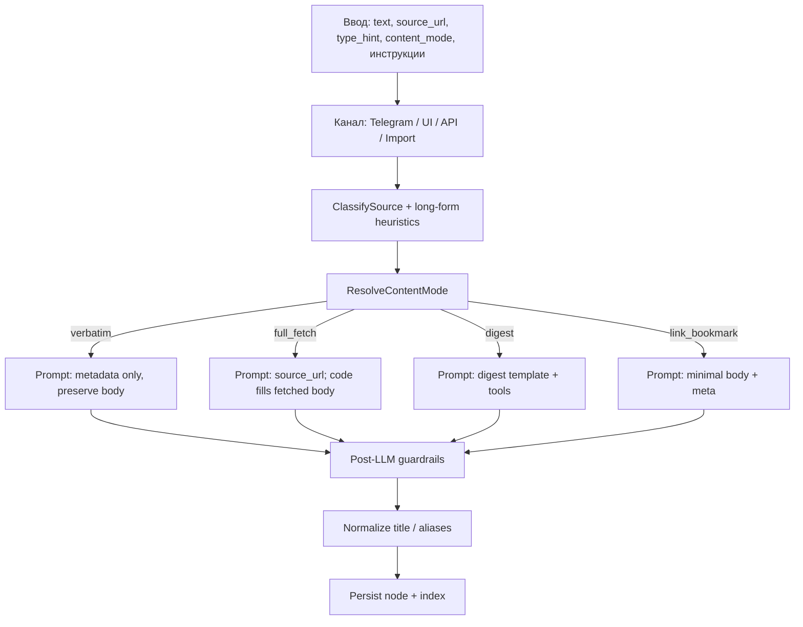

# Ingestion workflows: четыре режима обработки контента

Статус: **реализовано** (change `2026-06-08-ingestion-content-modes`).

## Проблема

Пользователь при добавлении материала преследует одно из нескольких **разных намерений**, но pipeline historically обрабатывал их одним LLM-путём:

1. **Сохранить текст как есть** — транскрипт, пересланный пост, черновик.
2. **Скачать полную статью с URL** — Habr, блог, документация.
3. **Сделать выжимку / digest** — концептуальное резюме для RAG без полного копирования.
4. **Закладка на ресурс** — URL + короткое semantic body (ресурс, сервис, канал).

Смешение приводит к типичным сбоям:

| Симптом | Причина |
|---------|---------|
| Вставленный транскрипт заменён scrape с YouTube/GitHub | `type=article` + URL → `ensureArticleContent` перезаписывает тело |
| Длинный Telegram-пост переписан в digest | Промпт требует и «сохранить markdown», и «переписать в conceptual_digest» |
| Ссылка или bookmark без тела при первом сохранении | body guardrail работает только для части refresh-сценариев |
| Заголовок с emoji/markdown из канала | Нормализация title не применяется детерминированно |

Явная ось **content mode** отделяет намерение пользователя от формы хранения (`type`) и шаблона digest (`content_profile`).

## Две оси метаданных

### Ось 1: форма хранения (уже есть, ADR 0010)

| Поле | Значения | Смысл |
|------|----------|--------|
| `type` | `article`, `link`, `note` | Как узел представлен в KB и UI |
| `source_kind` | web, telegram, github, … | Откуда пришёл материал |
| `content_profile` | `conceptual_digest`, `repository_profile`, `link_bookmark`, … | **Шаблон** digest/profile для link/note |

`type` и `content_profile` отвечают на вопрос «**что** лежит в файле и как индексируется», но не на вопрос «**откуда взять тело** при ingest».

### Ось 2: content mode (предлагается)

| Mode | Пользовательское намерение | Типичный `type` | Откуда берётся тело |
|------|---------------------------|-----------------|---------------------|
| `verbatim` | Сохранить предоставленный текст | `note` (реже `article`) | Ввод пользователя, без переписывания |
| `full_fetch` | Полная копия с сайта | `article` | Fetch по `source_url` |
| `digest` | Концептуальная выжимка | `note` или `link` | LLM по шаблону `content_profile` |
| `link_bookmark` | Минимальная закладка | `link` | Короткое semantic body из URL/meta/source text |
| `auto` | Система выбирает по правилам | — | Resolver до LLM |

`content_mode` не заменяет `type`: например, paste транскрипта с URL может быть `type=article` + `content_mode=verbatim`.

Инвариант: persisted body узла всегда непустой. Даже минимальная закладка должна иметь компактный текст, чтобы semantic search и RAG могли найти узел. `content_mode` не сохраняется во frontmatter; это request/response/logs-параметр ingest.

## Четыре workflow (пользовательский взгляд)

### 1. Verbatim capture («как есть»)

**Когда:** пользователь уже принёс готовый текст — переслал пост, вставил транскрипт, скопировал заметку.

**Ожидание:** markdown и структура сохраняются; LLM заполняет только metadata (keywords, theme_path, annotation).

**Не делать:** fetch по URL, rewrite в digest, подмена тела scrape-ом.

```text
Telegram long post + URL  →  verbatim  →  type=note, body=исходный текст
Add UI: paste + article hint  →  verbatim (auto)  →  body из paste
```

### 2. Full fetch («полная статья»)

**Когда:** только ссылка или явная просьба «сохрани полную статью».

**Ожидание:** тело загружается с `source_url` (Jina, fetch chain); перевод — отдельный async-путь для article.

```text
Forward: только https://habr.com/...  →  full_fetch  →  type=article
Инструкция: «сохрани полную статью»  →  full_fetch
```

### 3. Digest («выжимка / профиль»)

**Когда:** внешний источник без желания хранить полный текст; нужен плотный контекст для поиска и RAG (ADR 0010).

**Ожидание:** LLM (и при необходимости fetch preview) строит digest по `content_profile`; digest обязателен **уже при первом ingest**, не только при refresh.

```text
URL на длинную статью без paste  →  digest  →  type=note, conceptual_digest
GitHub repo URL  →  digest  →  type=link, repository_profile
```

### 4. Link bookmark («закладка»)

**Когда:** ссылка на сервис/канал/инструмент с минимальным телом; важны URL, annotation, placement.

**Ожидание:** body короткое, но непустое: что это за ресурс, почему он сохранён, какие ключевые термины помогут найти его через semantic search. Full article fetch и развёрнутый profile digest не нужны.

```text
Forward: ссылка на t.me/channel  →  link_bookmark  →  type=link
```

## Поток решения (target architecture)



### Приоритет resolver (кратко)

1. Явный `content_mode` из API/UI (не `auto`).
2. Текстовые маркеры: «как есть» → `verbatim`; «полная статья» → `full_fetch`; «выжимка/digest» → `digest`.
3. `type_hint=article` + только URL → `full_fetch`.
4. `type_hint=article` + существенное тело (порог ~500 символов / ~80 слов) → `verbatim`.
5. Telegram `t.me` + длинный текст → `verbatim`.
6. Только URL → `full_fetch` при `type_hint=article`; `digest` для профильных источников; `link_bookmark` для неизвестных/минимальных закладок.
7. Существенное тело (порог ~500 символов / ~80 слов вне URL) или long-form текст → `verbatim`, даже если в paste есть URL.
8. Fallback: digest для внешних источников с profile, `link_bookmark` для URL без profile, `verbatim` для чистого текста.

Детали — в [design.md](../../openspec/changes/2026-06-08-ingestion-content-modes/design.md).

## Post-LLM guardrails по mode

| Mode | Правило после LLM |
|------|-------------------|
| `verbatim` | Тело из ввода; не вызывать fetch для замены content |
| `full_fetch` | Тело из fetch/cache; explicit full fetch может заменить paste fetch-результатом |
| `digest` | `ensureModeContent` на ingest и refresh, structured digest обязателен |
| `link_bookmark` | `ensureModeContent` на ingest и refresh, compact semantic body обязательно |

## Каналы ввода

| Канал | Типичные сценарии | Default mode (auto) |
|-------|-------------------|---------------------|
| **Telegram** | forward URL, forward post, текст + URL, инструкция | По матрице resolver; long-form → verbatim |
| **Web Add** | paste + URL, type hint, явный selector mode | Auto; UI даёт override |
| **API** `POST /api/ingest` | автоматизация, интеграции | `content_mode=auto` |
| **Import session** | bulk Telegram archive | Auto; UI даёт override |

MCP ingest tool сейчас отсутствует и не входит в scope change. Если он появится позже, он должен использовать тот же enum `content_mode` и тот же response contract.

### API (планируется)

```json
{
  "text": "...",
  "source_url": "https://example.com/article",
  "type_hint": "article",
  "content_mode": "auto"
}
```

Ответ `POST /api/ingest` — envelope:

```json
{
  "node": {
    "path": "topic/example"
  },
  "content_mode": "verbatim"
}
```

`content_mode` в ответе — resolved mode для отладки; во frontmatter он не пишется.

### Web UI (планируется)

Селектор «Режим сохранения»: Авто | Как есть | Полная статья | Выжимка | Закладка. Этот selector главный для обработки тела. В UI используется label «Как есть» для `verbatim`.

`type_hint` остаётся вторичной подсказкой формы хранения. `type_hint=article` больше не должен быть единственным способом сказать «у меня уже есть текст». Комбинация «Как есть + Статья» означает `content_mode=verbatim`, `type_hint=article`: сохранить paste как article без fetch-замены.

Import session на Add page использует такой же selector режима и передаёт `content_mode` в accept API.

## Связь с `type` и digest-профилями

| content_mode | Частый `type` | `content_profile` |
|--------------|---------------|-------------------|
| verbatim | note | обычно пустой; если profile уже есть у существующего узла, mode всё равно запрещает rewrite тела |
| full_fetch | article | — |
| digest | note или link | conceptual_digest, repository_profile, … |
| link_bookmark | link | обычно `link_bookmark` или пустой; это persisted profile, не persisted mode |

Digest-профиль описывает **форму выжимки**; content mode описывает **нужно ли переписывать** предоставленный текст.

## Нормализация заголовков

Независимо от mode, перед persist:

- убрать markdown-ссылки из `title`;
- перенести leading emoji в конец (правило markdown-normalization);
- применить к `aliases[0]` при одном alias.

LLM не должен быть единственным местом очистки заголовков каналов.

## Текущее vs целевое поведение

| Сценарий | Сейчас (проблема) | Цель |
|----------|-------------------|------|
| Paste транскрипт + YouTube URL + article | Scrape заменяет paste | `verbatim`, body из paste |
| Длинный Telegram-пост | Digest rewrite | `verbatim` |
| Forward только URL на статью | Иногда пустой digest | `digest` или `full_fetch` по resolver + ensure на ingest |
| Bookmark/link без богатого profile | Может быть пустой body | `link_bookmark` + compact semantic body |
| Title `🔥 [Name](url)` | Сохраняется как есть | Нормализация в коде |
| GitHub README + Jina fallback | Jina может затереть README | Выбор более информативного preview |

## Регрессии из debug issues (ориентиры для тестов)

- `hermes-desktop-doklad` — paste + article + YouTube
- `gemma-4-lokalnyj-ii-na-8gb-vram` — Telegram verbatim
- `httptrace-...` — title noise
- `plagin-bezopasnosti-dlya-claude` — пустое тело после forward с текстом

## Non-goals

- Массовый backfill существующих узлов.
- Новый обязательный `type` вместо article/link/note.
- Полный отказ от LLM для placement и keywords.
- Сохранение `content_mode` во frontmatter.
- MCP ingest tool и Telegram inline-кнопки выбора режима.

## Refresh-description

Так как `content_mode` не сохраняется во frontmatter, refresh выводит mode из stored node. Body emptiness — repair trigger после выбора mode, а не основной selector:

| Stored node | Refresh mode | Поведение |
|-------------|--------------|-----------|
| `type=article` + `source_url` | `full_fetch` | восстановить/обновить полную статью |
| `type=link` + profile кроме пустого/`link_bookmark` | `digest` | обновить structured profile digest |
| `type=link` + пустой/`link_bookmark` profile | `link_bookmark` | обновить compact semantic body |
| `type=note` + `conceptual_digest`/`brief_digest` + `source_url` | `digest` | обновить note digest |
| `type=note` без digest profile | `verbatim` | не переписывать body, только безопасная metadata-актуализация |

Пустой body у существующего узла считается repair case. Если есть `source_url`, refresh создаёт body по inferred mode; если нет — завершается понятной ошибкой без выдумывания содержания.

## Ссылки

- [OpenSpec proposal](../../openspec/changes/2026-06-08-ingestion-content-modes/proposal.md)
- [OpenSpec design](../../openspec/changes/2026-06-08-ingestion-content-modes/design.md)
- [ADR 0004](../adr/0004-ingestion-pipeline-llm-orchestration.md)
- [ADR 0010](../adr/0010-link-article-digest-for-retrieval.md)
- [ADR 0011](../adr/0011-ingestion-content-modes.md) (proposed)
