# Knowledge DB

## Персональная база знаний с AI-агентами

<br/>

**Принципы:** оффлайн-first · git-first · LLM-optional

<br/>

<div style="font-size: 0.7em; color: #666;">
Igor Lazarev · 2026
</div>

---

## Концепция проекта

<table>
<tr>
<td style="vertical-align:top; width:50%;">

**Запись — онлайн**

- Web UI (React SPA)
- Telegram бот
- REST API
- MCP (в разработке)

</td>
<td style="vertical-align:top; width:50%;">

**Чтение — оффлайн**

- Локальная база в git
- Markdown + YAML frontmatter
- Версионирование, diff, merge
- Доступна без интернета

</td>
</tr>
</table>

<br/>

> Ничего не потеряется — надёжная версионируемая база под вашим контролем

---

## Стек технологий

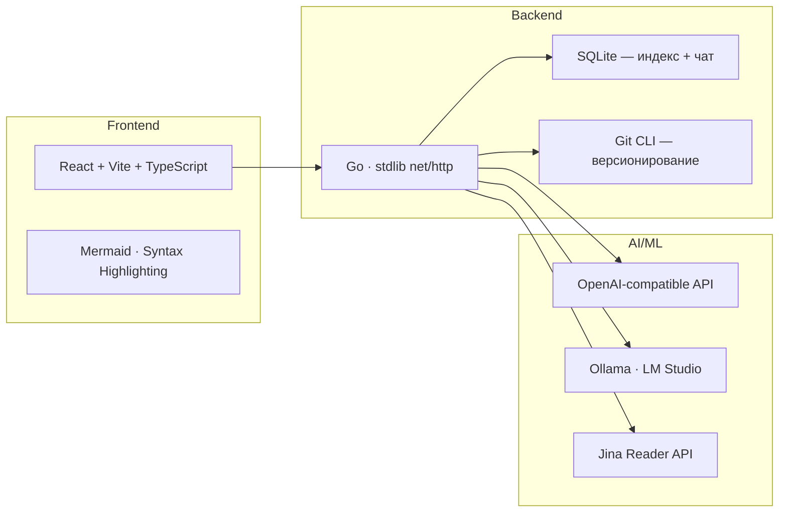

---

## Архитектура системы

```mermaid
graph TB
    subgraph Клиенты
        WEB[Web UI<br/>React SPA]
        TG[Telegram Bot<br/>Long Polling]
        API_CL[REST API<br/>Клиенты]
        MCP[MCP Server<br/>stub]
    end

    subgraph kb-server — Go
        direction TB
        API_LAYER[API Layer<br/>HTTP Handlers + Auth]
        INGEST[Ingestion Pipeline<br/>LLM Orchestrator]
        IDX[Index System<br/>Embeddings + FTS5]
        CHAT[RAG Chat<br/>Hybrid Search + LLM]
        KB_STORE[KB Store<br/>Filesystem + Git]
        GIT[Git Sync<br/>Auto Commit + Push]
    end

    subgraph Хранилище
        FS[data/<br/>Markdown + Frontmatter]
        SQLITE_IDX[index.db<br/>Embeddings + Chunks + FTS]
        SQLITE_CHAT[chat.db<br/>Sessions + Messages]
    end

    subgraph Внешние API
        LLM[OpenAI-compat API<br/>LLM + Embeddings]
        JINA[Jina Reader<br/>Content Fetcher]
    end

    WEB --> API_LAYER
    TG --> INGEST
    API_CL --> API_LAYER
    API_LAYER --> INGEST
    API_LAYER --> CHAT
    INGEST --> KB_STORE
    INGEST --> LLM
    INGEST --> JINA
    CHAT --> IDX
    CHAT --> LLM
    IDX --> SQLITE_IDX
    CHAT --> SQLITE_CHAT
    KB_STORE --> FS
    KB_STORE --> GIT
    GIT --> FS
    IDX --> LLM
```

---

## Серверная часть: bootstrap

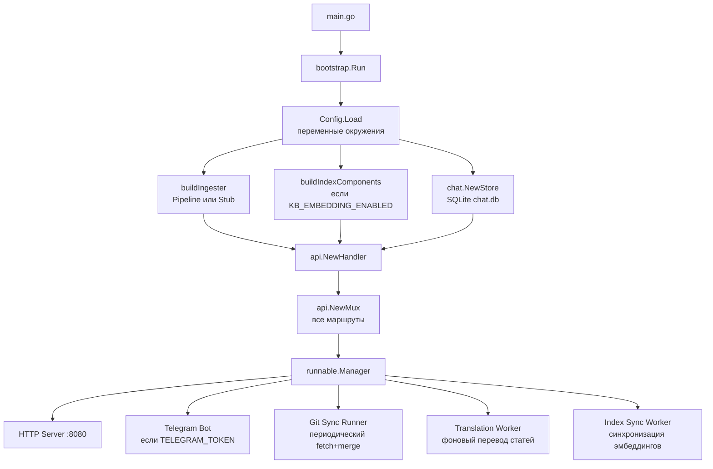

---

## Где используется LLM

<br/>

<table>
<tr>
<th style="text-align:left;">Компонент</th>
<th style="text-align:left;">Роль LLM</th>
<th style="text-align:left;">API</th>
</tr>
<tr>
<td><b>Ingestion Pipeline</b></td>
<td>Классификация, аннотирование, ключевые слова, выбор темы</td>
<td>OpenAI Responses API + Function Calling</td>
</tr>
<tr>
<td><b>Перевод статей</b></td>
<td>Чанкованный перевод на русский</td>
<td>Chat Completions</td>
</tr>
<tr>
<td><b>RAG Chat</b></td>
<td>Ответы на основе контента базы знаний</td>
<td>Chat Completions SSE</td>
</tr>
<tr>
<td><b>Query Rewrite</b></td>
<td>Оптимизация поискового запроса для RAG</td>
<td>Responses API</td>
</tr>
<tr>
<td><b>Git Commit Messages</b></td>
<td>Генерация conventional commit</td>
<td>Chat Completions</td>
</tr>
</table>

---

## Ingestion Pipeline — обзор

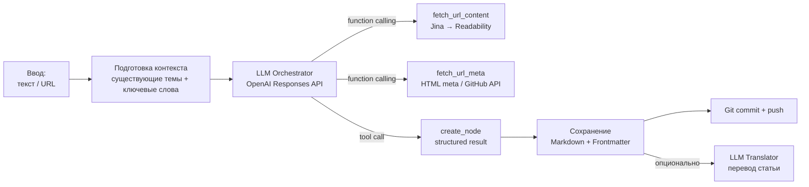

---

## Ingestion — LLM Orchestrator

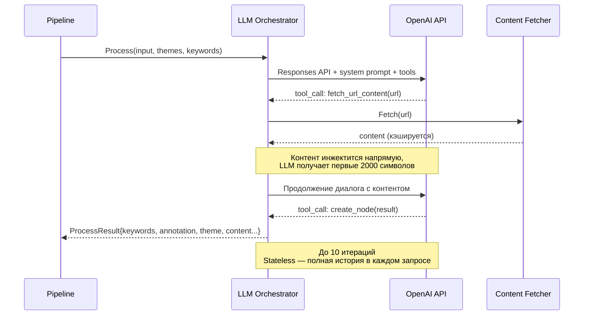

---

## Ingestion — инструменты LLM

<table>
<tr>
<th style="text-align:left;">Tool</th>
<th style="text-align:left;">Назначение</th>
<th style="text-align:left;">Данные</th>
</tr>
<tr>
<td><code>fetch_url_content</code></td>
<td>Получить полный контент по URL</td>
<td>Jina Reader API → fallback Readability</td>
</tr>
<tr>
<td><code>fetch_url_meta</code></td>
<td>Метаданные URL (title, description)</td>
<td>GitHub API → HTML &lt;meta&gt; парсинг</td>
</tr>
<tr>
<td><code>create_node</code></td>
<td>Создать узел БЗ (финальное действие)</td>
<td>keywords, annotation, theme_path, slug, type, content, source_url, title</td>
</tr>
</table>

<br/>

**Системный промпт** задаёт правила:

- Типы контента: `article`, `link`, `note`
- Аннотации и ключевые слова — на русском
- Выбор существующей темы или создание новой
- Для ссылок — конкретика без маркетинговых штампов

---

## RAG Chat — общая схема

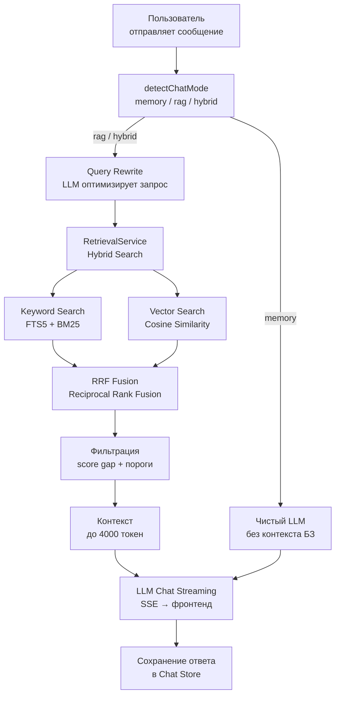

---

## RAG Chat — режимы работы

<br/>

<table>
<tr>
<th style="text-align:left;">Режим</th>
<th style="text-align:left;">Когда</th>
<th style="text-align:left;">Поведение</th>
</tr>
<tr>
<td><code>memory</code></td>
<td>«суммируй чат»</td>
<td>Только LLM, без поиска по БЗ</td>
</tr>
<tr>
<td><code>rag</code></td>
<td>«найди в базе...»</td>
<td>Строгий поиск — только контекст из БЗ</td>
</tr>
<tr>
<td><code>hybrid</code></td>
<td>по умолчанию</td>
<td>Сначала БЗ, затем fallback на знания LLM</td>
</tr>
</table>

<br/>

**Query Rewrite** — LLM переписывает запрос пользователя в компактные поисковые термины с учётом словаря базы знаний (aliases, keywords, titles).

---

## Embedding & Index System

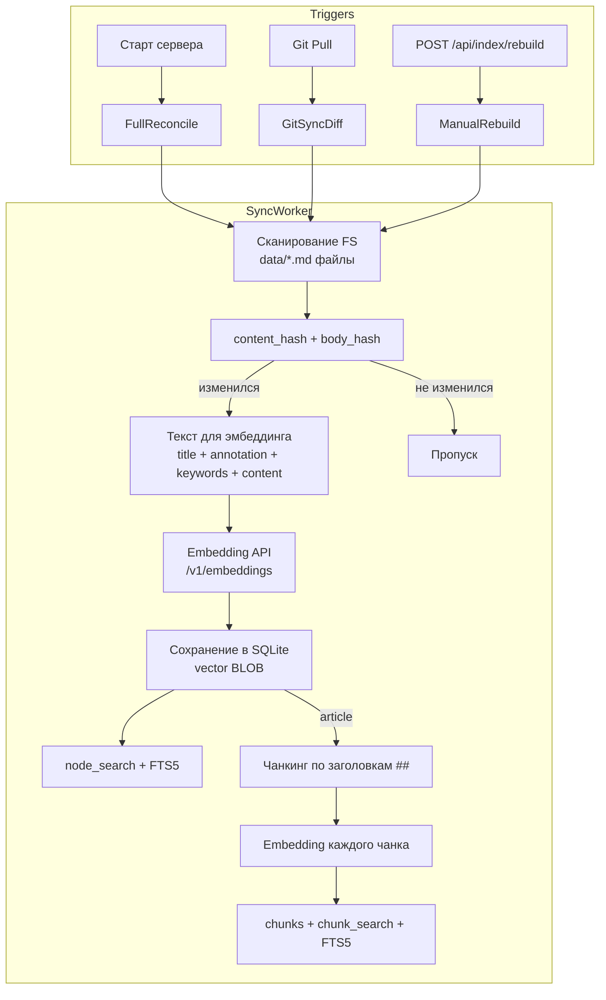

---

## Hybrid Search — RRF Fusion

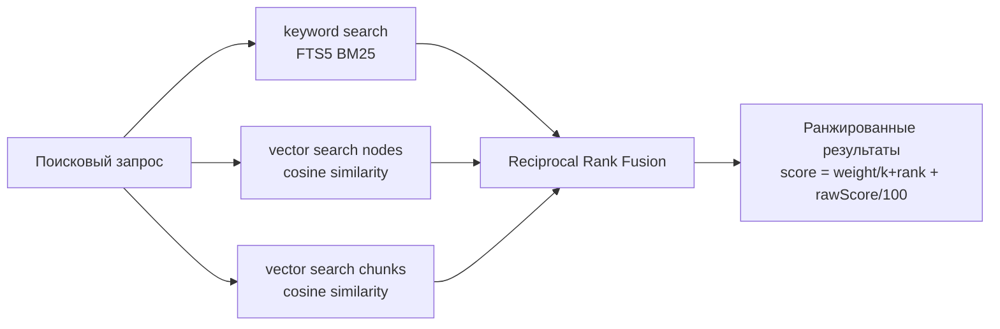

<br/>

**Веса RRF:**

| Источник | Вес | Примечание |
|----------|-----|------------|
| keyword node | 1.8 | BM25 + exact boost |
| keyword chunk | 1.6 | BM25 + FTS5 |
| vector node | 1.0 | Cosine similarity |
| vector chunk | 1.0→0.25 | Убывающий по кол-ву чанков ноды |

---

## Chat Session Memory

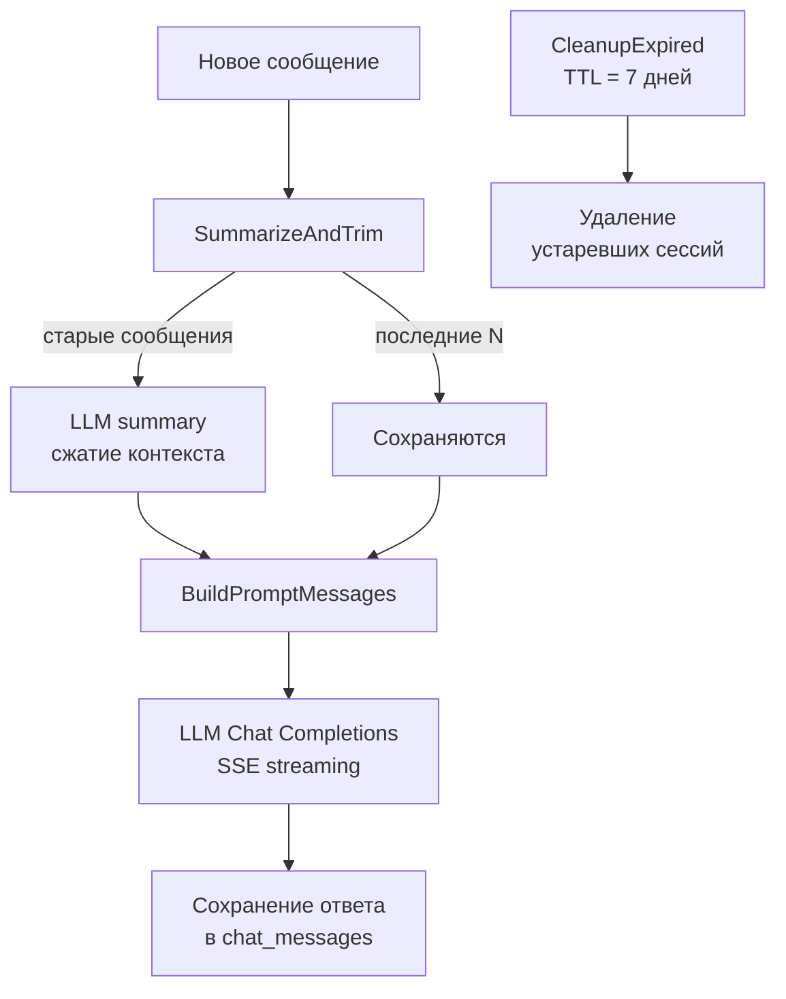

<br/>

**Параметры:** maxMessages = 40, maxContextRunes = 24000, sessionTTL = 7d

---

## Telegram Bot

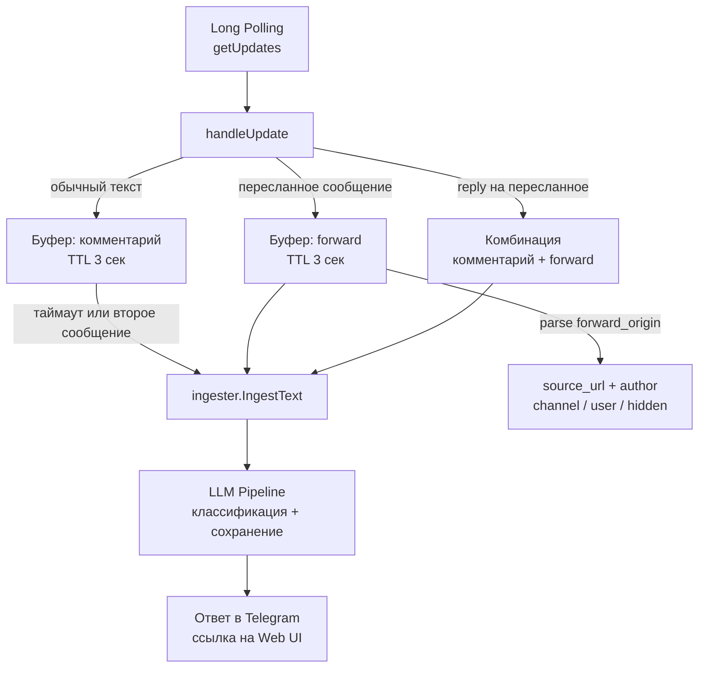

---

## Telegram Bot — Entity Processing

<br/>

Telegram → Markdown конвертация:

- **Bold** → `**bold**`
- *Italic* → `*italic*`
- `Code` → `` `code` ``
- Links → `[text](url)`
- Pre blocks → ` ```code``` `

<br/>

**Forward Origin** — определение источника:

| Тип | Данные |
|-----|--------|
| Channel | source_url из channel, author из подписи |
| User | author из имени пользователя |
| Hidden user | автор не определён |

---

## Git Integration с LLM

```mermaid
flowchart LR
    subgraph Commit
        NODE[Создание/изменение<br/>узла БЗ] --> DIFF[git diff]
        DIFF --> MSG_GEN[CommitMessageGenerator]
        MSG_GEN --> LLM[LLM генерирует<br/>conventional commit]
        LLM --> COMMIT[git commit -m "msg"]
        COMMIT --> PUSH[git push]
    end
    
    subgraph Sync
        INTERVAL[Каждые 5 мин] --> FETCH[git fetch]
        FETCH --> MERGE[git merge]
        MERGE --> RECONCILE[Reconcile индекса<br/>FS vs indexed]
    end
```

<br/>

**Сериализация** — `SerializedGitCommitter` обёрнут в mutex для предотвращения конкурентных git операций.

---

## Перевод статей

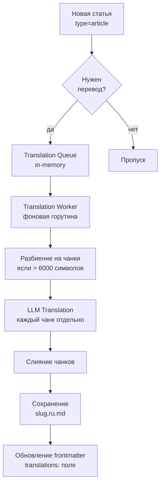

---

## Auth & Security

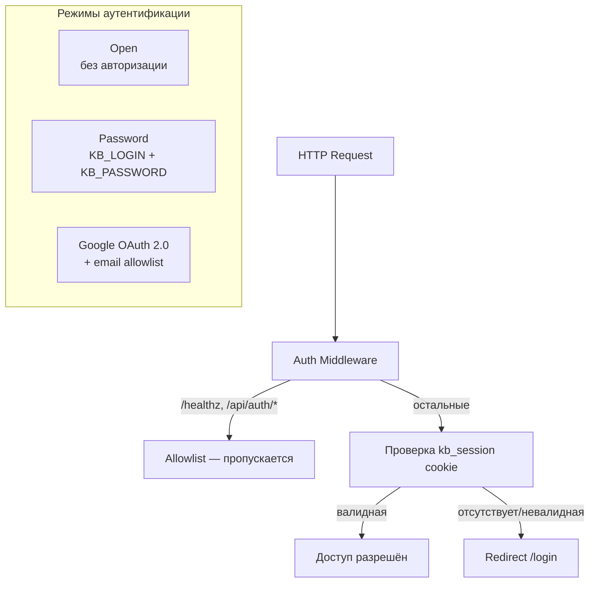

<br/>

Сессии — in-memory store с TTL (по умолчанию 8h), cookie `Secure` требует HTTPS.

---

## Web UI

```mermaid
flowchart TD
    subgraph React SPA — Vite
        NAV[Navbar<br/>Topic Tree] --> OVERVIEW[OverviewPage<br/>Browse + Filter]
        NAV --> NODE_P[NodePage<br/>View + Edit]
        NAV --> ADD[AddPage<br/>Text / URL Ingest]
        NAV --> SEARCH[SearchPage<br/>Hybrid Search]
        NAV --> CHAT_P[ChatPage<br/>RAG Chat SSE]
        NAV --> LOGIN_P[LoginPage<br/>Password / OAuth]
    end

    OVERVIEW --> API_TS[api.ts<br/>TypeScript клиент]
    NODE_P --> API_TS
    ADD --> API_TS
    SEARCH --> API_TS
    CHAT_P --> API_TS
    LOGIN_P --> API_TS
    API_TS --> REST[REST API :8080]
```

<br/>

**Особенности UI:** Mermaid-диаграммы, подсветка синтаксиса, PWA, мобильная адаптация, SSE-streaming чат.

---

## Model Context Protocol

<br/>

**Текущий статус:** stub — `GET/POST /api/mcp` → 501

<br/>

**Планируемая функциональность:**

- Подключение внешних AI-агентов (Claude, GPT и др.)
- Инструменты для работы с базой знаний
- Стандартизированный протокол взаимодействия

<br/>

Спецификация: `openspec/specs/mcp-server/`

---

## Data Model

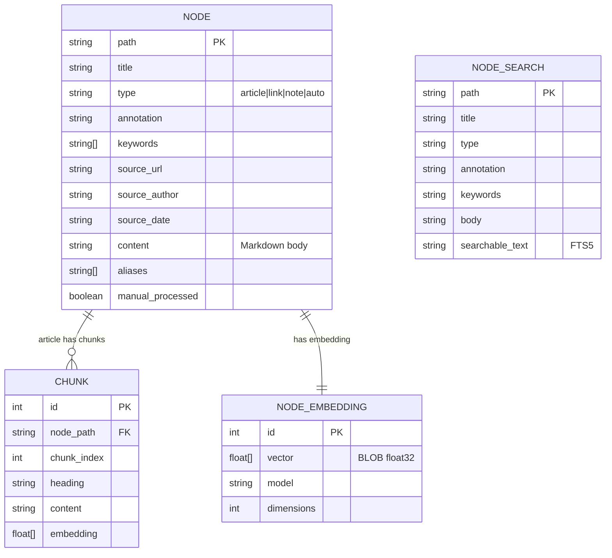

---

## Дизайн-решения

<br/>

<table>
<tr>
<td style="vertical-align:top; width:50%;">

**Хранение**

- Markdown + YAML frontmatter
- Git — источник правды
- SQLite — только индексы
- Локальность — без облака

</td>
<td style="vertical-align:top; width:50%;">

**AI — опционально**

- LLM не настроен → `StubIngester`
- Embeddings off → FTS5 keyword search
- Graceful degradation на каждом уровне

</td>
</tr>
<tr>
<td style="vertical-align:top; width:50%;">

**Совместимость**

- OpenAI-compatible API
- Ollama, LM Studio, OpenRouter
- Любая модель эмбеддингов

</td>
<td style="vertical-align:top; width:50%;">

**Синхронизация**

- Git auto-commit с LLM-сообщениями
- Периодический fetch+merge
- FS watcher → re-index

</td>
</tr>
</table>

---

## Ключевые технологии

<br/>

<div style="font-size: 0.9em;">

| Слой | Технология | Назначение |
|------|-----------|------------|
| Backend | Go 1.25 | Сервер, API, Telegram бот |
| Frontend | React + Vite + TypeScript | SPA интерфейс |
| Хранение | Markdown + YAML frontmatter | Узлы базы знаний |
| Индексация | SQLite + FTS5 | Полнотекстовый поиск |
| Векторный поиск | SQLite + float32 BLOB | Cosine similarity |
| LLM | OpenAI Responses API | Ingestion, function calling |
| LLM | Chat Completions API | RAG чат, перевод, коммиты |
| Embeddings | /v1/embeddings | Векторные представления |
| Контент | Jina Reader + Readability | Извлечение контента URL |
| Git | CLI exec | Версионирование базы |
| Контейнеризация | Docker + GitHub Actions | Сборка и деплой |

</div>

---

## Запуск и конфигурация

<br/>

**Минимальный запуск:**

```bash
KB_DATA_PATH=/path/to/data ./kb-server
```

**С AI-функциями:**

```bash
export KB_DATA_PATH=/path/to/data
export LLM_API_URL=https://openrouter.ai/api/v1
export LLM_API_KEY=sk-...
export LLM_MODEL=gpt-4o
export KB_EMBEDDING_ENABLED=true
export KB_EMBEDDING_API_URL=http://localhost:11434
export KB_EMBEDDING_MODEL=bge-m3
export KB_CHAT_MODEL=llama3
./kb-server
```

**Docker:**

```bash
docker run -d -p 8080:8080 \
  -v /path/to/knowledge-base:/data \
  -e KB_DATA_PATH=/data \
  ghcr.io/strider2038/knowledge-db:latest
```

---

## Итоги

<br/>

**Knowledge DB** — персональная система управления знаниями, где AI-компоненты играют ключевую роль:

<br/>

1. **LLM Orchestrator** — интеллектуальная классификация и структурирование контента
2. **RAG Chat** — гибридный поиск + генерация ответов на основе базы знаний
3. **Embedding Index** — векторные представления для семантического поиска
4. **Function Calling** — многошаговые LLM-пайплайны с инструментами
5. **Query Rewrite** — оптимизация поисковых запросов с учётом словаря БЗ
6. **Auto Translation** — фоновый перевод статей через LLM
7. **Smart Commits** — осмысленные git-коммиты через LLM

<br/>

> Все AI-функции опциональны — система работает и без них

---

## Ссылки

<br/>

- **Репозиторий:** https://github.com/strider2038/knowledge-db
- **Лицензия:** MIT © 2026 Igor Lazarev
- **Спецификации:** `openspec/specs/` — 25 детальных спецификаций
- **Agent Skills:** `.cursor/skills/` — навыки для IDE
