# Knowledge DB

## Персональная база знаний с AI-агентами

<br/>

**Принципы:** оффлайн-first · git-first · LLM-optional

<br/>

<div style="font-size: 0.7em; color: #666;">
Igor Lazarev · 2026
</div>

---

## Концепция

```mermaid
graph LR
    subgraph Запись — онлайн
        WEB[Web UI]
        TG[Telegram]
        API[REST API]
    end
    subgraph Хранение — git
        KB[(База знаний<br/>Markdown файлы)]
    end
    subgraph Чтение — оффлайн
        LOCAL[Локальный клон<br/>доступен без интернета]
    end
    WEB --> KB
    TG --> KB
    API --> KB
    KB --> LOCAL
```

> Git как источник правды: версионирование, diff, merge

---

## Архитектура системы

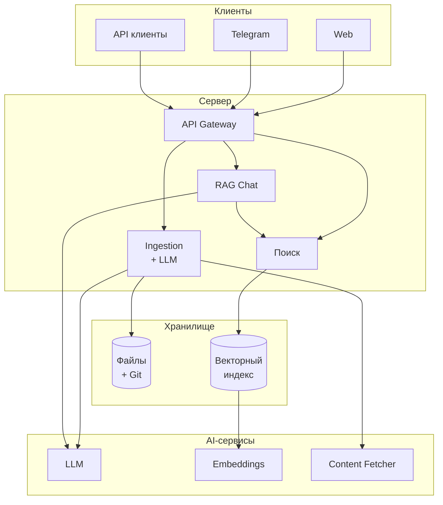

---

## Где используется LLM

<br/>

| Компонент | Роль LLM |
|-----------|----------|
| **Ingestion** | Классификация, аннотирование, выбор темы, ключевые слова |
| **RAG Chat** | Ответы на основе контента базы знаний |
| **Query Rewrite** | Оптимизация поискового запроса |
| **Перевод** | Автоматический перевод статей |
| **Git** | Генерация осмысленных commit-сообщений |

<br/>

> Принцип: LLM опционален — без него система работает с ограничениями

---

## Ingestion Pipeline

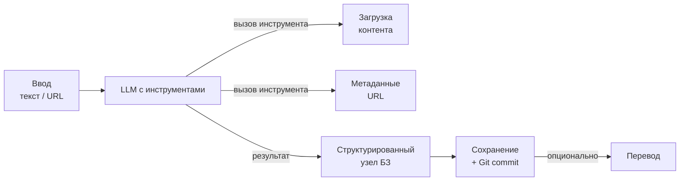

---

## Ingestion — LLM с Function Calling

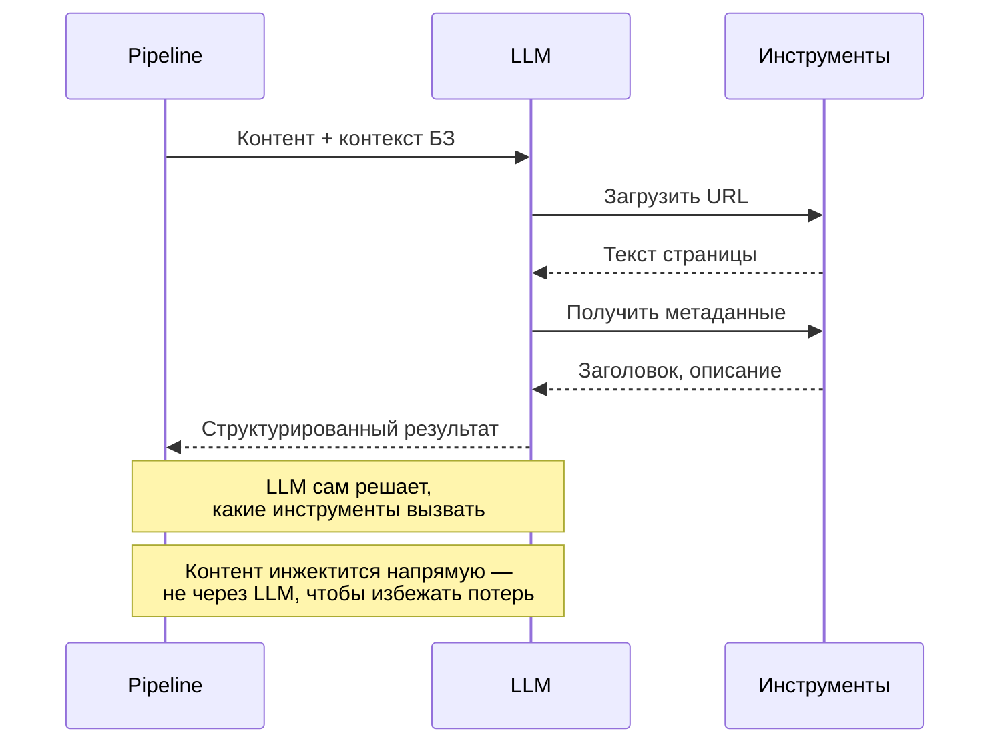

---

## RAG Chat

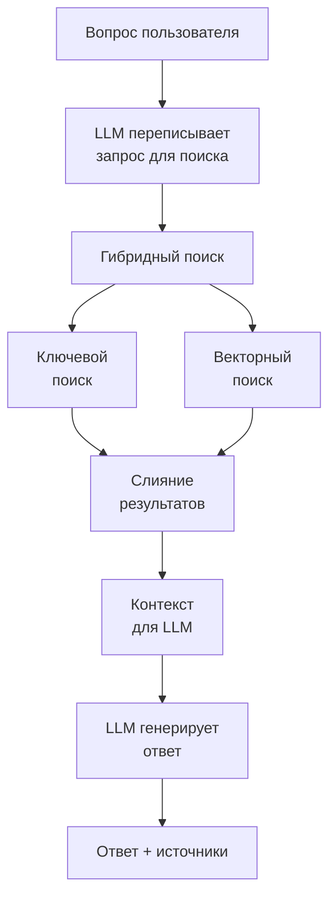

---

## Три режима чата

<br/>

| Режим | Когда | Поведение |
|-------|-------|-----------|
| **Memory** | Управление чатом | LLM без обращения к БЗ |
| **RAG** | Поиск в базе | Только контекст из БЗ |
| **Hybrid** | По умолчанию | БЗ + знания LLM |

<br/>

**Query Rewrite** — LLM переписывает запрос пользователя в поисковые термины с учётом словаря базы знаний.

---

## Векторный индекс

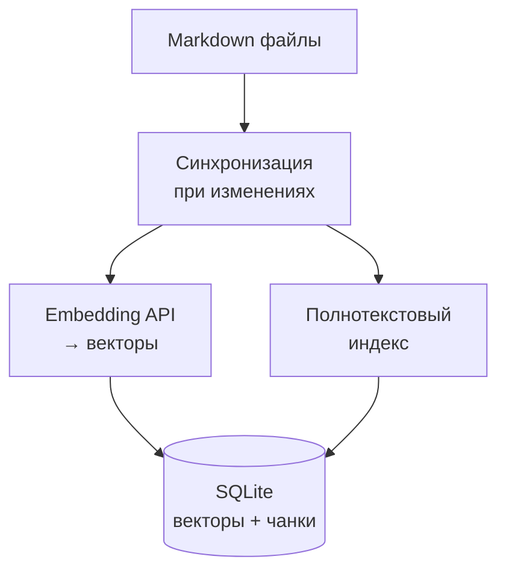

<br/>

**Чанкинг:** статьи разбиваются по заголовкам — каждый фрагмент получает свой вектор для точного поиска.

---

## Гибридный поиск

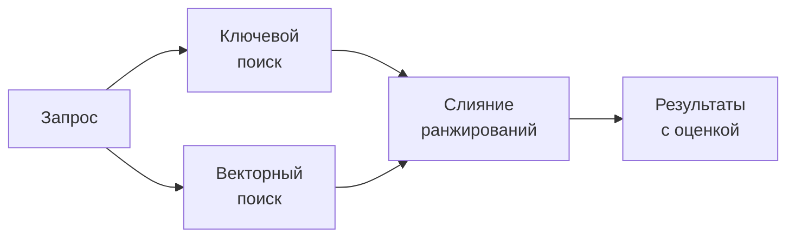

<br/>

**Reciprocal Rank Fusion** — объединяет два подхода к поиску:
- **Ключевой** — точные совпадения слов, быстрый
- **Векторный** — семантическое сходство, находит по смыслу

Ключевой поиск имеет повышенный вес — он точнее для известных терминов.

---

## Telegram Bot

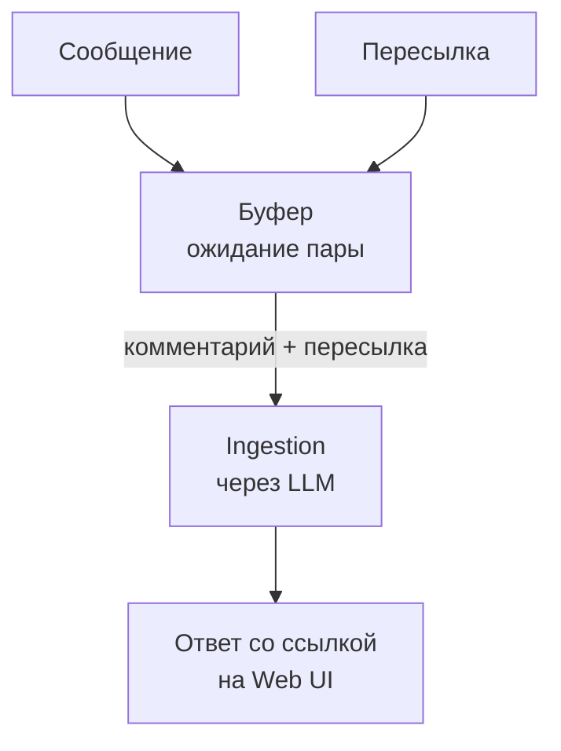

<br/>

**Концепция:** пользователь может добавить комментарий к пересланному сообщению. Бот ждёт 3 секунды, чтобы получить оба сообщения вместе.

---

## Git + LLM

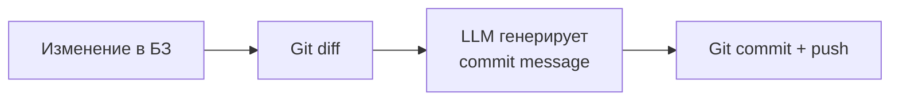

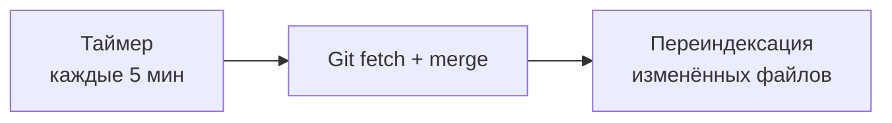

---

## Перевод статей

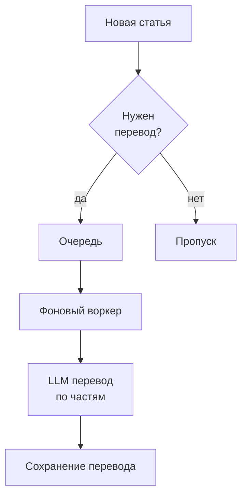

---

## Аутентификация

<br/>

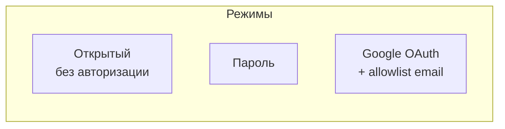

<br/>

Три взаимоисключающих режима. Сессии in-memory с TTL. Открытый режим по умолчанию — для localhost.

---

## Web UI

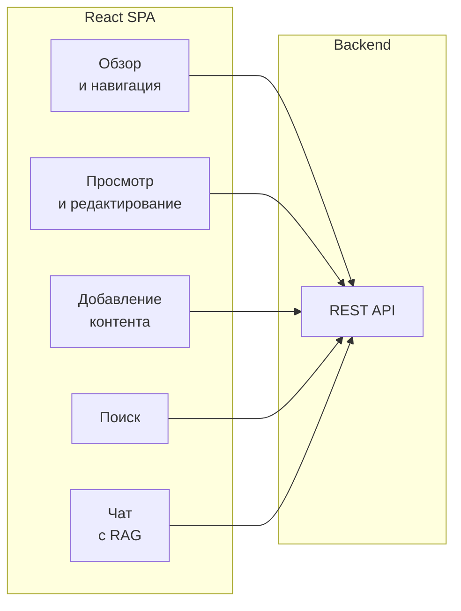

<br/>

SSE-streaming для чата, поддержка Mermaid-диаграмм, мобильная адаптация.

---

## Ключевые концептуальные решения

<br/>

<table>
<tr>
<td style="vertical-align:top; width:50%;">

**Файлы, не БД**

- Markdown + Git
- Версионирование «из коробки»
- Локальность и контроль

</td>
<td style="vertical-align:top; width:50%;">

**Graceful degradation**

- Без LLM → ручной ввод
- Без embeddings → ключевой поиск
- Без интернета → полная функциональность

</td>
</tr>
<tr>
<td style="vertical-align:top; width:50%;">

**OpenAI-compatible**

- Любой провайдер
- Локальные модели (Ollama)
- Нет привязки к вендору

</td>
<td style="vertical-align:top; width:50%;">

**AI повсюду**

- Ingestion через Function Calling
- RAG для чата и поиска
- Автоперевод и автокоммиты

</td>
</tr>
</table>

---

## Итоги

<br/>

**Knowledge DB** — персональная база знаний, где AI пронизывает все уровни:

<br/>

1. **Ingestion** — LLM с инструментами классифицирует и структурирует контент
2. **RAG Chat** — гибридный поиск + генерация ответов на основе базы
3. **Векторный индекс** — семантический поиск по embeddings
4. **Query Rewrite** — LLM оптимизирует запросы для поиска
5. **Auto Translation** — фоновый перевод через LLM
6. **Smart Commits** — осмысленные git-коммиты

<br/>

> Все AI-функции опциональны — система работает и без них

---

## Ссылки

<br/>

- **Репозиторий:** https://github.com/strider2038/knowledge-db
- **Лицензия:** MIT © 2026 Igor Lazarev
- **Спецификации:** `openspec/specs/`
- **Agent Skills:** `.cursor/skills/`
